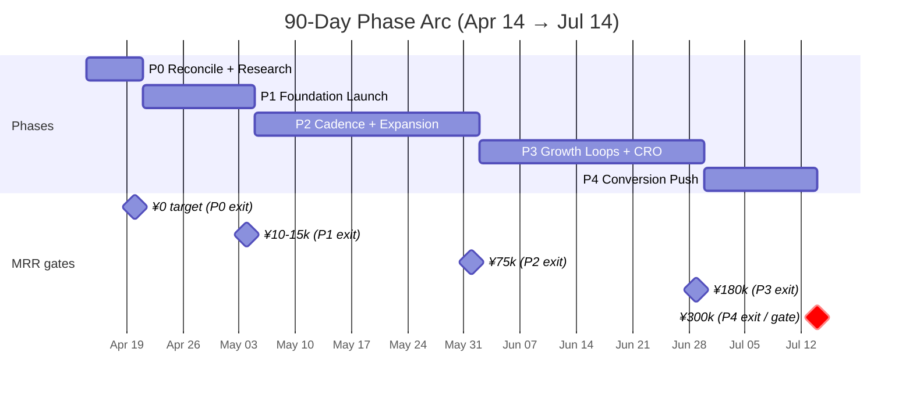
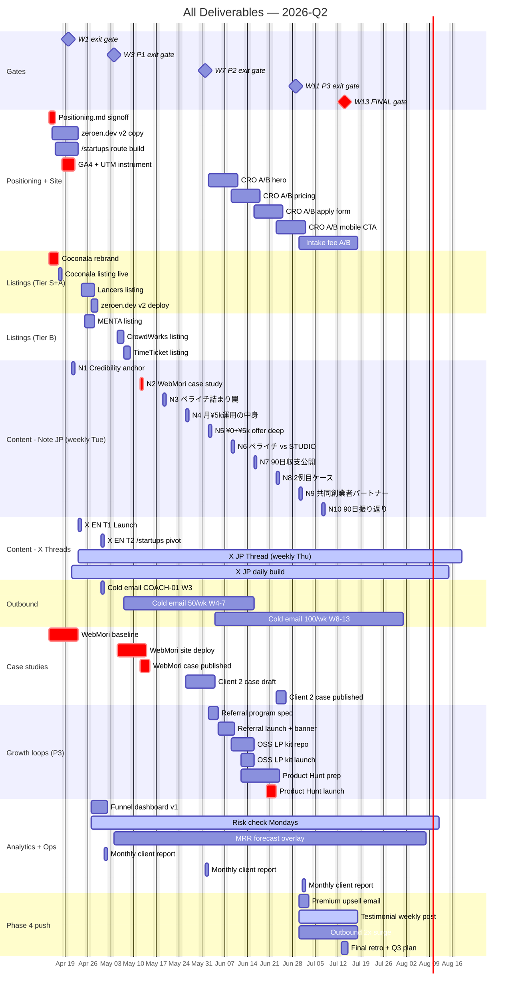
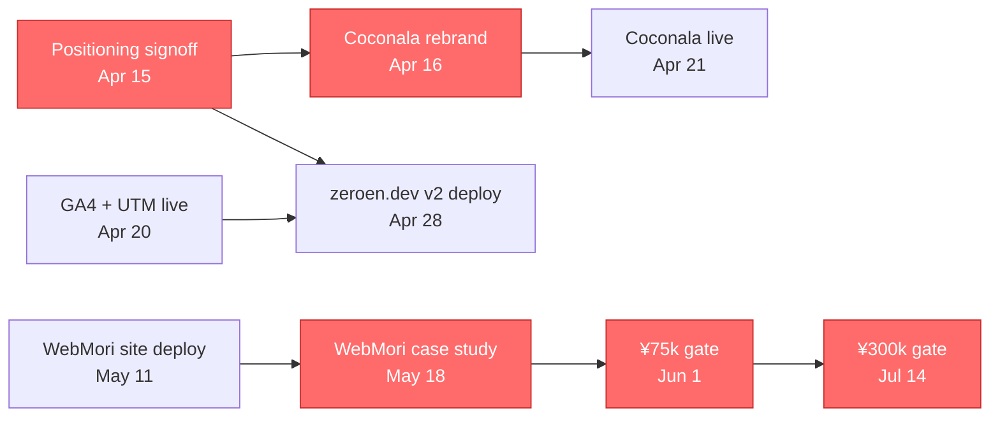

# 90-Day Roadmap — Consolidated Timeline

**Window:** 2026-04-14 → 2026-07-14 (13 weeks) · **Target:** ¥300k MRR · **Base case:** ¥200k · **Owner:** operator · **Updated:** 2026-04-14

Single-page gantt view of every major deliverable on one timeline. Built from `golden-puzzling-bubble.md` + `content-calendar.md` + `weekly-rituals.md`. If those disagree with this, this is downstream — fix the source and regenerate.

---

## Phase arc + MRR curve

---

## Full-deliverable gantt

---

## Week-by-week summary table

| Week | Dates | Phase | Theme | Critical path item | MRR target |
|---|---|---|---|---|---|
| W1 | Apr 14-20 | 0 | Research + reconcile | Positioning signoff + Coconala rebrand + GA4 | ¥0 |
| W2 | Apr 21-27 | 1 | Listings go live | Coconala live Mon + Note article Tue + X threads Wed | ¥0-5k |
| W3 | Apr 28-May 4 | 1 | zeroen.dev v2 + outbound pilot | Site deploy Mon + 25 cold emails + 2 signed Basic | ¥10-15k |
| W4 | May 5-11 | 2 | Tier-B listings | CrowdWorks + TimeTicket + WebMori site deploy | ¥20-30k |
| W5 | May 12-18 | 2 | **WebMori case study** | Case on Note + zeroen.dev + X JP/EN | ¥35-50k |
| W6 | May 19-25 | 2 | Cadence lock + first risk read | Funnel dashboard live + W6 MRR check | ¥50-65k |
| W7 | May 26-Jun 1 | 2 | Second case prep + MRR gate | P2 exit gate ≥¥75k | ¥75k |
| W8 | Jun 2-8 | 3 | Referral program | Announce + email blast + hero A/B test | ¥100k |
| W9 | Jun 9-15 | 3 | OSS LP kit | github.com/zeroen-dev/lp-kit public + pricing A/B | ¥120k |
| W10 | Jun 16-22 | 3 | Product Hunt launch | PH JP + EN + apply form A/B | ¥145k |
| W11 | Jun 23-29 | 3 | CRO + 2nd case study | Mobile CTA A/B + 2nd case published | ¥180k |
| W12 | Jun 30-Jul 6 | 4 | Premium upsell | Email Basics + intake fee A/B | ¥230k |
| W13 | Jul 7-13 | 4 | Final push | Testimonial flywheel + outbound 2× | **¥300k** |

---

## Critical-path dependencies

These items block something downstream. Slip them and the whole plan shifts.

**The 5 critical-path items:**
1. Positioning signoff (Apr 15) — blocks every copy decision
2. Coconala rebrand (Apr 16) — blocks W2 launch
3. WebMori case study (May 18) — blocks credibility; affects every channel conversion
4. ¥75k at W7 (Jun 1) — trigger threshold for Risk R3 "drop Basic from outreach"
5. ¥300k at W13 (Jul 14) — the final gate feeding Oct 15 Malaysia GO/NO-GO decision

---

## Kill-switch decision points (embedded in timeline)

Monday reviews run the risk-register. These trigger dates are when specific kill-switches might fire:

| Date | Check | If triggered |
|---|---|---|
| May 11 (W4 Mon) | Coconala <5 inquiries/wk? | Shift weight to Lancers + outbound (R1) |
| May 11 (W4 Mon) | WebMori site not deployed? | Launch best-available, iterate post (R12) |
| May 18 (W5 Fri) | WebMori case not published? | Ship at quality-available; follow-up W7 (R7) |
| May 25 (W6 Mon) | apply_submit / visits <1%? | Pause SEO, full CRO sprint (R2) |
| Jun 1 (W7 Mon) | MRR <¥75k? | Drop Basic from outbound; Premium-only (R3) |
| Jun 22 (W10 Mon) | Net MRR <¥150k? | Hard-route to Stripe-direct, cap Coconala (R4) |
| Anytime | Positioning confusion resurfaces? | Freeze publishing, rerun positioning (R5) |
| 2 consecutive weeks | Operator <15h/wk capacity? | Drop Phase 3 growth loops (R6) |

Full risk register: `HQ/marketing/plan/risk-register.md`.

---

## Default weekly rhythm (all 13 weeks)

```mermaid
gantt
    title Default Week — Mon → Sun
    dateFormat  HH:mm
    axisFormat  %H:%M

    section Mon
    MRR + pipeline review   :09:00, 30m
    Risk register walk      :09:30, 30m
    Publish week calendar   :10:00, 30m
    Client check-ins        :10:30, 30m
    X JP daily post         :11:00, 15m

    section Tue
    Note article live       :09:00, 60m
    X JP link to Note       :10:00, 30m

    section Wed
    Pipeline review         :09:00, 60m
    Send proposals          :10:00, 60m
    X EN build-in-public    :14:00, 30m

    section Thu
    Cold email batch        :09:00, 60m
    X JP thread             :10:00, 60m
    Coconala outreach       :14:00, 60m

    section Fri
    Content retro           :10:00, 60m
    Next-week batch review  :11:00, 60m
    X EN thread             :14:00, 60m
    Finance close           :16:00, 30m

    section Sat
    Light X JP share        :10:00, 30m

    section Sun
    Rest / optional prep    :10:00, 60m
```

Source: `HQ/marketing/plan/weekly-rituals.md`.

---

## Deliverable ownership matrix

Every item on the gantt has exactly one owner (draft) + one reviewer.

| Deliverable class | Draft | Review | Approve/publish |
|---|---|---|---|
| Positioning | mktg-gtm | mktg-strategy | operator |
| Listings (Coconala/Lancers/etc.) | sales-advisor | mktg-copy | operator |
| Note articles | mktg-copy | mktg-strategy | operator |
| X threads (JP + EN) | mktg-copy | mktg-strategy (Fri batch) | operator |
| X daily builds | mktg-copy (7-batch) | mktg-strategy (batch approve) | operator |
| Cold email sequences | sales-advisor | mktg-strategy | operator |
| Case studies | mktg-copy + client-manager | mktg-strategy | operator |
| Website code | web-developer | code-reviewer | operator |
| CRO tests | mktg-cro | mktg-strategy | operator |
| Analytics dashboards | mktg-cro + finance-tracker | operator | operator |
| Referral program | mktg-growth | sales-advisor | operator |
| OSS LP kit | web-developer | code-reviewer + mktg-gtm | operator |
| Product Hunt launch | mktg-gtm | mktg-copy (EN voice) | operator |
| Monthly client reports | ops-scheduler + web-developer | client-manager | operator |
| Risk + MRR reports | finance-tracker | operator | operator |

---

## How to use this file

- **Monday mornings:** glance at the current week column in the weekly table. Confirm critical-path items are on track. Check kill-switch dates.
- **Friday retros:** mark any slippage. If an item moves, update `content-calendar.md` (the source) and re-run this file's gantt.
- **Quarterly reset:** after Jul 14, archive this roadmap; draft the Q3 roadmap using the same structure. Do not reuse dates — start fresh.

---

## Related

- 90-day plan: `/Users/Daito/.claude/plans/golden-puzzling-bubble.md`
- Content calendar (detail): `HQ/marketing/plan/content-calendar.md`
- Weekly rituals (hourly): `HQ/marketing/plan/weekly-rituals.md`
- Risk register: `HQ/marketing/plan/risk-register.md`
- Phase 0 summary: `HQ/marketing/plan/phase-0-summary.md`
- Positioning: `HQ/marketing/plan/positioning.md`
