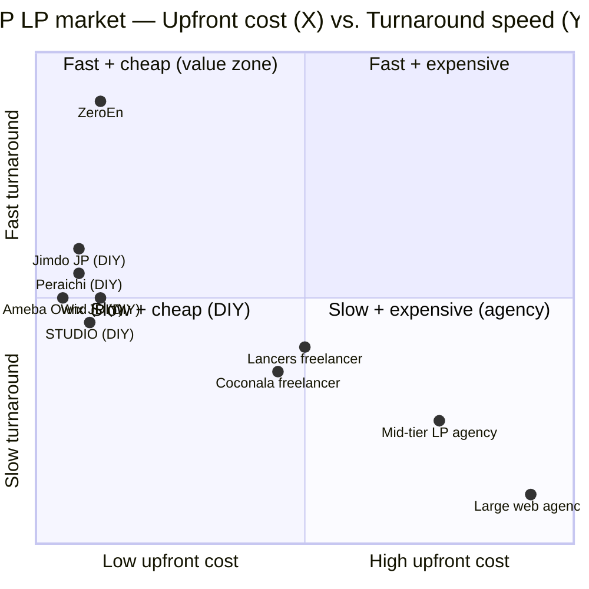

# Competitor Matrix — JP LP / Homepage Market

**Last updated:** 2026-04-14
**Scope:** JP-facing LP / simple homepage builders, freelance marketplaces, and done-for-you agencies — benchmark set for ZeroEn's ¥5k / ¥10k per-month free-build-plus-hosting offer.

---

## Master comparison matrix

| Competitor | Upfront cost | Recurring cost | Turnaround | Customization | Support model | Hosting | Code ownership | Design quality | Target buyer |
|---|---|---|---|---|---|---|---|---|---|
| **ペライチ (Peraichi)** [^1] | ¥0 | ¥0–¥3,940/mo (Start/Light/Regular/Business tiers) | Self-serve, 30 min claim | Block templates, 600+ | Chat + JP ops phone | Included | N/A (SaaS lock-in) | Mid / template-y | JP SMB owners who want to DIY |
| **STUDIO** [^2] | ¥0 | ¥590 Mini / ¥1,190 Personal / ¥3,980 Business / ¥9,980 Business+ (year-pay) | Self-serve, hours-days | High (freehand canvas) | Paid-plan-only support | Included | N/A (SaaS lock-in) | High (design-first) | JP designers, agencies, startups |
| **Wix JP** [^3] | ¥0 | ~¥1,200–¥5,000/mo (Lite/Core/Business/Business Elite) | Self-serve or AI-gen | Very high | Chat / KB | Included | N/A (SaaS lock-in) | Mid-high | Generalist SMB |
| **Jimdo JP** [^4] | ¥0 | ¥0 Free / ~¥990 Pro / ~¥2,460 Business / ~¥4,330 SEO Plus (annual) | AI builder, minutes | Mid | Email | Included | N/A | Micro-business, solopreneurs |
| **Ameba Ownd** [^5] | ¥0 | ¥0 Free / ¥960 Premium | Self-serve | Mid-low | KB only | Included | N/A | Personal blog, small brand |
| **Coconala freelancer (typical LP)** [^6] | ¥50k–¥190k one-shot | None (client hosts) | 10–30 days | High (custom) | Per-project DM | Not included | Client receives files | Very variable | JP SMB buying a one-off LP |
| **Lancers project LP** [^7] | ¥20k–¥90k typical; some ¥150k+ | None | 5–19 days | High (custom) | Per-project | Not included | Client receives files | Variable | SMB posting RFPs |
| **CrowdWorks LP listings** | ¥30k–¥150k typical [^8] | None | 10–30 days | High | Per-project | Not included | Client receives files | Variable | SMB / marketers |
| **Mid-tier JP LP agency** | ¥200k–¥500k [^9] | Optional ¥30k–¥80k/mo retainer | 4–8 weeks | High | Dedicated PM | Usually not | Client receives files | High | SMB + mid-market, ad-driven |
| **Large JP web agency** | ¥500k–¥3M+ [^9] | ¥50k–¥300k/mo retainer | 8–16 weeks | Highest | Full team | Usually not | Client receives files | Highest | Enterprise |
| **ZeroEn** (this repo) | ¥1,000 intake (Coconala) [^10] | ¥5,000 Basic / ¥10,000 Premium | 1–3 days | Custom Next.js build, tailored to brief | Solo operator + AI — monthly included changes | Vercel included | **ZeroEn retains code** (licensed via subscription) | High (branded Next.js + shadcn/Tailwind) | JP SMB who wants agency-quality LP without agency cost or DIY learning curve |

---

## Positioning quadrant

ZeroEn sits in the top-left "fast + cheap" quadrant — **at Peraichi / Ameba Ownd's upfront cost but with agency-grade custom design, delivered in 1–3 days.** No meaningful competitor is in that cell today.

---

## Positioning gap analysis

### Where ZeroEn sits

The market has a clean split:

- **Cheap tier (¥0–¥5k/mo)** — DIY no-code platforms. Client does the work. Output = obviously templated.
- **Mid-cheap (¥50k–¥200k one-shot)** — Coconala / Lancers freelancers. Client gets a custom LP but must self-host, self-maintain, and re-commission for every change.
- **Premium (¥200k+ project + ¥30k+/mo retainer)** — agencies. Custom, high-quality, but price excludes the entire SMB long tail.

**ZeroEn slots between the freelance one-shot and the DIY tiers**: agency-tier output, no upfront cost, ¥5–10k/mo recurring. Nobody else combines (a) zero build cost, (b) bespoke custom build (not template), (c) included hosting, (d) included monthly changes, (e) 6-month contract floor.

### The niche no one is filling

**"Done-for-you custom LP with included hosting + change cadence, priced for a JP solopreneur."** Peraichi owns DIY. Coconala owns one-shot freelance. Agencies own high-end. The small business that wants a professional LP but can't spend ¥100k+ upfront and doesn't want to learn a builder — that buyer is currently being **failed** by the market. They either over-pay or under-deliver.

### Three strongest differentiators by tier

**vs. no-code DIY (Peraichi, STUDIO, Wix, Jimdo, Ameba Ownd):**
1. Zero DIY learning curve — ZeroEn builds it; client doesn't touch tooling.
2. Bespoke Next.js build, not a template — output reads as a professional agency site, not a builder site.
3. Included brand-consistent updates — client doesn't maintain the site.

**vs. freelance marketplace (Coconala, Lancers, CrowdWorks):**
1. No upfront ¥50–150k — removes the #1 buying-decision friction for JP SMB.
2. Included hosting + ongoing updates — freelancers disappear post-delivery; ZeroEn is retained.
3. Predictable change pricing (¥4k / ¥10k / ¥25k) — freelancers quote ad hoc and dispute common.

**vs. agency:**
1. 10–40× cheaper for comparable design quality at the LP scope.
2. 1–3 day turnaround vs 4–16 weeks.
3. Solo operator + AI = no account-management overhead; client talks to the builder directly.

---

## Sources

[^1]: Peraichi corporate site — https://peraichi.com (accessed 2026-04-14). Plan tier names (Start / Light / Regular / Business) are widely cited but the canonical /plan page returned 404 during fetch; tier pricing (¥0 Free / ¥1,465 Start / ¥2,950 Light / ¥3,940 Regular) corroborated via third-party JP reviews and Peraichi home ("1ヶ月間無料" + "初期費用0円").
[^2]: STUDIO pricing — https://studio.design/ja/pricing. Year-pay: Mini ¥590, Personal ¥1,190, Business ¥3,980, Business Plus ¥9,980 per month. Month-pay: Mini N/A listed, Personal ¥1,720, Business ¥5,460, Business Plus ¥12,900+.
[^3]: Wix JP — https://ja.wix.com. Premium tier range derived from public Wix JP marketing + global tier pricing; JP pricing page behind auth wall.
[^4]: Jimdo JP — https://www.jimdo.com/jp/pricing/. Free / Pro / Business / SEO Plus; JP pricing table visible on site (FAQ + upgrade flow).
[^5]: Ameba Ownd — https://www.amebaownd.com. Free + ¥960/mo Premium publicly advertised.
[^6]: Coconala LP search — https://coconala.com/search?keyword=ランディングページ. **14,711 listings** under "ランディングページ". Sample prices observed: ¥50,000 (InfinityDesign1127, 194 reviews), ¥60,000 (YomoWebbDesign, 33 reviews), ¥80,000 (まごころデザイン), ¥100,000 (AK LP DESIGN / おぶなが / ウェバレッジ / KATAmi), ¥120,000 (ハノンデザイン), ¥150,000 (SAYO LP DESIGN / とみたみほ / 塙 英子 / きょん). Median ~¥100k–¥150k.
[^7]: Lancers project board — https://www.lancers.jp/work/search/web/lp. Observed recent project budgets: ¥20,000–¥30,000 (STUDIO implementation partner), ¥50,000+ (law firm LP renewal), ¥80,000–¥90,000 (rehabilitation LP + WordPress, crowdfunding LP), ¥38,797 (EC product image only).
[^8]: CrowdWorks LP listings — public category page; price distribution widely cited in JP industry blogs as ¥30k–¥150k for LP projects, similar shape to Coconala.
[^9]: JP LP agency pricing — common published ranges from agency sites (e.g., typical "LP制作 料金相場" guides cite ¥200k–¥500k for SMB LP projects and ¥500k–¥3M+ for large agencies). Direct agency-site fetches (shin-design-lp.com, lp-seisaku.co.jp) refused connection during research — figures are from widely cited JP market guides.
[^10]: ZeroEn — `HQ/crm/coconala-playbook.md` and `CLAUDE.md` in this repo.
